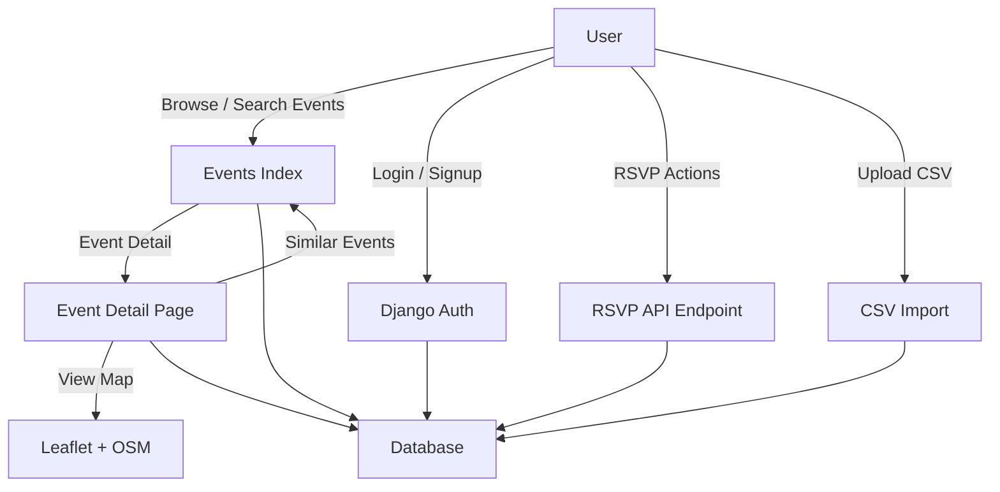
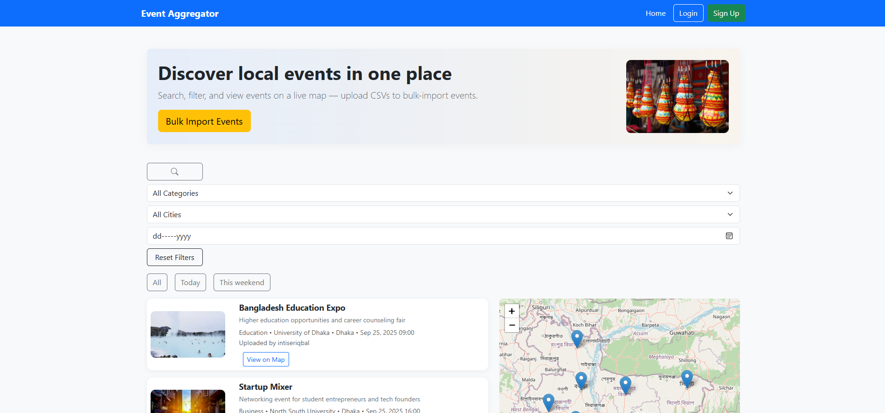
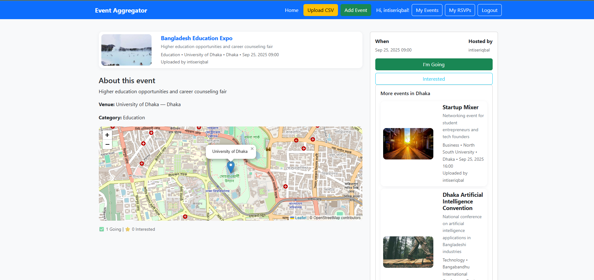
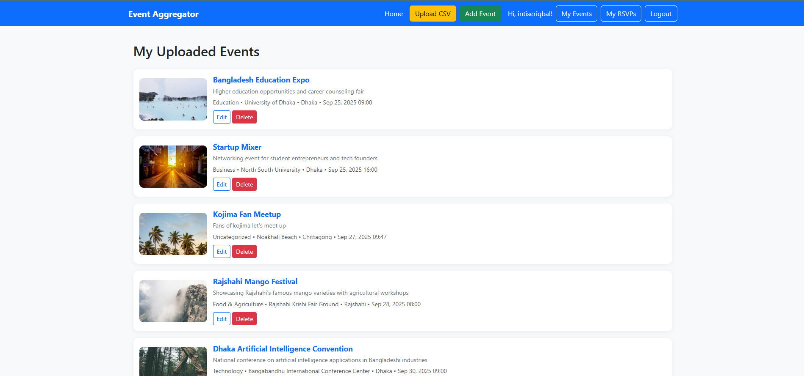
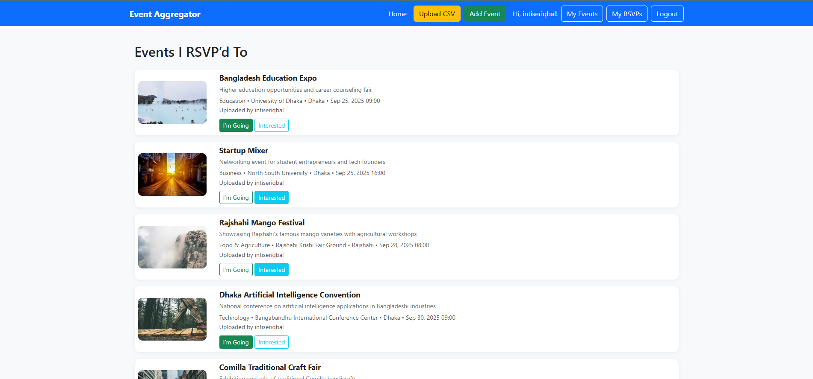
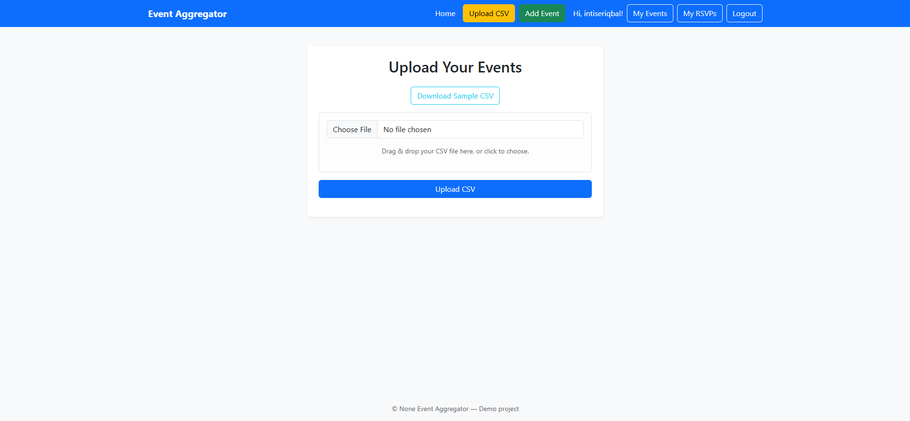

# Event Aggregator (Capstone Project)

A web application for discovering, creating, and managing events. Users can RSVP to events ("Going" or "Interested"), view event details, and explore events on an interactive map. Built with Django, JavaScript, and Leaflet.js, this project demonstrates full-stack integration and a real-world event management workflow.

## 🚀 Key Features

- **User Authentication**: Signup, login, logout with secure sessions.
- **Event Management**: Create, edit, delete events (CRUD operations).
- **RSVP System**: Track "Going" and "Interested" status with live updates.
- **Event Discovery**: Search and filter by city, category, or keyword.
- **Map Integration**: Display event location using Leaflet maps.
- **Bulk Upload**: Import events from CSV files with validation.
- **Pagination**: Efficient browsing of events and RSVPs.
- **Similar Events**: Suggestions based on city of current event.

## 🛠 Tech Stack

- **Backend**: Django (Python)
- **Frontend**: HTML, CSS (Bootstrap), JavaScript (AJAX)
- **Database**: SQLite (development)
- **Mapping**: Leaflet.js + OpenStreetMap
- **Other**: CSV import/export, Django Messages Framework

## 📊 Architecture Diagram



## ⚙️ Installation & Setup

1. **Clone repository:**
   ```bash
   git clone https://github.com/me50/intiserIqbal.git
   cd event-aggregator
   ```

2. **Create and activate virtual environment:**
   ```bash
   python -m venv venv
   source venv/bin/activate  # on Linux/Mac
   venv\Scripts\activate     # on Windows
   ```

3. **Install dependencies:**
   ```bash
   pip install -r requirements.txt
   ```

4. **Run migrations:**
   ```bash
   python manage.py makemigrations
   python manage.py migrate
   ```

5. **Start development server:**
   ```bash
   python manage.py runserver
   ```

6. **Visit** http://127.0.0.1:8000/

## 📸 Usage / Demo

- **Homepage**: Browse upcoming events with RSVP buttons.
    
- **Detail Page**: See full event info, RSVP status, and map.
    
- **My Events**: Manage your own events.
    
- **My RSVPs**: Track events you've marked.
    
- **CSV Upload**: Quickly add multiple events.
    


## 📂 Project Structure

```
event-aggregator/
│── events/
│   ├── models.py       # Event, Venue, Category, RSVP models
│   ├── views.py        # Core logic: CRUD, RSVP, CSV, search
│   ├── forms.py        # EventForm & CSV Upload form
│   ├── templates/      # HTML templates
│   │   ├── events/...
│   │   │── registration/...
│   │   │── layout.html
│   └── static/         # CSS, JS
│── db.sqlite3
│── manage.py
│── requirements.txt
│── README.md
```

## 🔑 Distinctiveness & Complexity

**Unlike the course's prior projects:**

- This is **not a social network** (distinct from Project 4).
- This is **not an e-commerce site** (distinct from Project 2).
- It combines event discovery, RSVP management, and mapping, making it functionally different and more complex.

**Complexity lies in:**

- Integrating Django models with AJAX-based RSVP toggling.
- Handling CSV bulk import with validation and duplicate checks.
- Dynamic event filtering and pagination.
- Map rendering with Leaflet for geospatial visualization.

This combination of features provides a real-world, production-style web application that exceeds the scope of the earlier projects.

## 📡 API (Optional Endpoints)

- `/api/events/` → Returns JSON of all events (with filtering support).
- `/api/events?city=Dhaka&category=Business` → Filtered query.

Each event includes: `id`, `title`, `description`, `category`, `venue`, `city`, `date`, `latitude`, `longitude`, `rsvp_status`.

## 🚧 Limitations / Future Enhancements

**Current Limitations:**
- CSV Upload requires latitude & longitude for map display.
- No payment/ticketing system like Eventbrite.
- No recurring events support yet.

**Future Ideas:**
- User profiles with past RSVPs.
- Email notifications for upcoming events.
- Admin dashboard for event analytics.
- Social sharing integration.